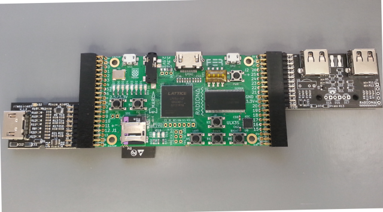
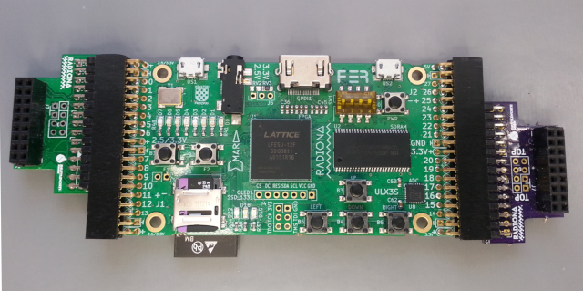

# PMOD-quickstart

## USB and GPDI

Sugested way of connecting GPDI and USB PMOD is this:

### USB

As for the USB - this is the only way to connect it, as at TOP RIGHT corner ULX3S has 5V pins.

Be carefull when you connect other PMODS to that place!

On USB PMOD there is also experimental area (J2) and placeholders for IR LEDs and IR Receiver.

LEDs are connected in series are driven from 5V with 2N7002 N-channel MOSFET already placed onboard.

* [USB design files](hhttps://github.com/goran-mahovlic/ulx3s-PMOD/tree/master/USB)

* [OSH Park PCB ordering](https://oshpark.com/shared_projects/TgORPIvj)

### GPDI

As for the GPDI - GPDI IN is designed for this position as on this position we have all differential bidirectional pins gp[11:9],gn[11:9] allong differential clock capable pins gp[12],gn[12]

* [GPDI design files](https://github.com/goran-mahovlic/ulx3s-PMOD/tree/master/GPDI_ULX3S_PMOD)
* [OSH Park PCB ordering](https://oshpark.com/shared_projects/18Ev7IXp)

## OV7670

Sugested way of connecting OV7670 is this:

You can also test other ways of connection just be warned about TOP RIGHT 5V from ULX3S!

* [PMOD design files](https://github.com/goran-mahovlic/ulx3s-PMOD/tree/master/OV7670)
* [OSH Park PCB ordering](https://oshpark.com/shared_projects/qdydUa2Y)

## Code

### USB

* [USB project](https://github.com/emard/ulx3s-misc/tree/master/examples/usb/proj/lattice/ulx3s/usbhid_host)

Should output some HEX on OLED and onboard GPDI output

When you connect keyboard to US3 or US4 (or both) you should see some change...

### GPDI

GPDI OUT (you will need to adapt pins in lpf and top module)

* [GPDI OUT project](https://github.com/emard/ulx3s-misc/tree/master/examples/dvi)

GPDI IN (Use buttons to sync all signals (R,G,B,CLOCK))

* [GPDI IN project](https://github.com/emard/ulx3s-misc/tree/master/examples/dvi_in)

### OV7670

* [OV7670 project](https://github.com/emard/ulx3s-misc/tree/master/examples/ov7670_dvi/proj/ulx3s_ov7670_dvi)

Should display camera picture on onboard GPDI output

### PMOD set orders

* [CrowdSupply campaign page](https://www.crowdsupply.com/radiona/ulx3s)

If you need help, please let us know:

## Chat and support

### Discord chanel

* [Discord chat](https://discord.gg/qwMUk6W) Problems/question/general chat

### Gitter chanel

* [Gitter chat](https://gitter.im/ulx3s/Lobby) Focused on development

### Email

    ulx3s.fpga@gmail.com (If you do not use chats)

Many thanks for sponsorships and help:

### OSH Park

* [OSH Park webpage](https://oshpark.com/)

 

### Shuttleworth foundation

* [Shuttleworth webpage](https://shuttleworthfoundation.org/)

### IRNAS

* [IRNAS webpage](https://www.irnas.eu/)
* [IRNAS git](https://github.com/IRNAS)
	

Helping hands: Marvin(Radiona), Emard(Radiona), Prizma(Radiona), mmicko, Drew Fustini (OSH Park), SnapEDA, smunaut(tnt)